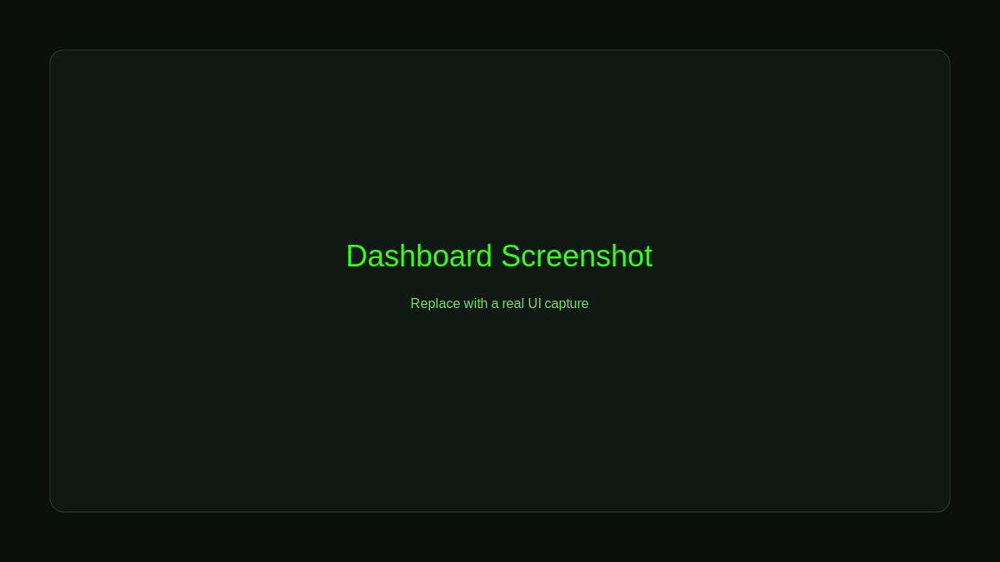
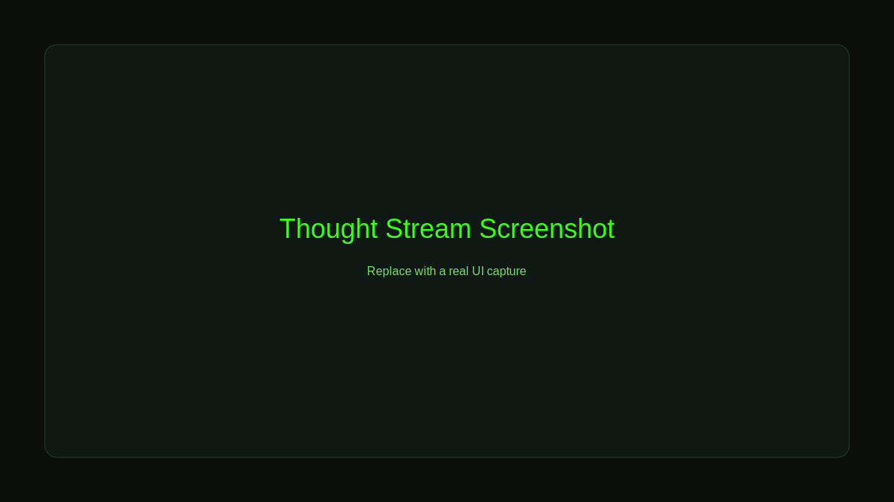
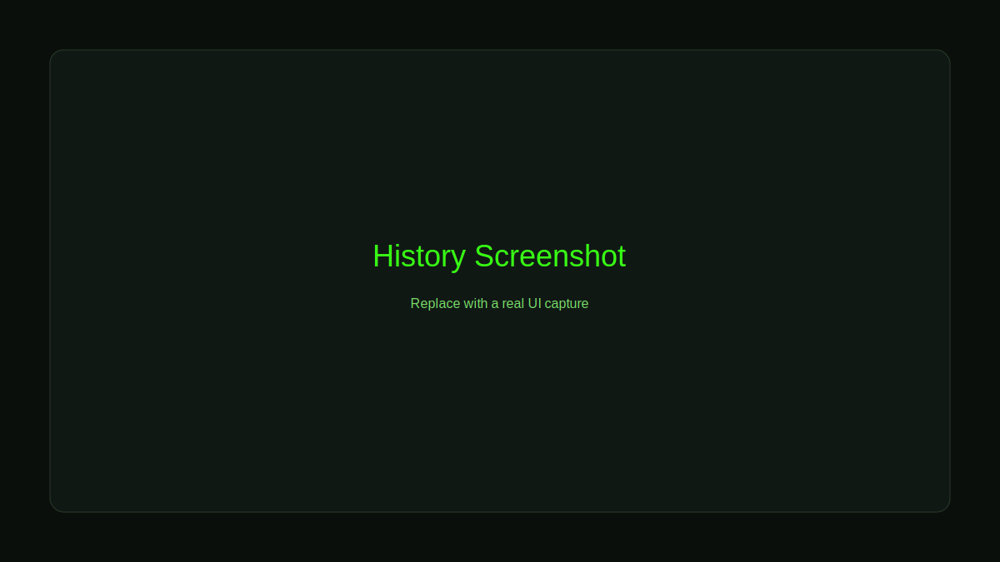
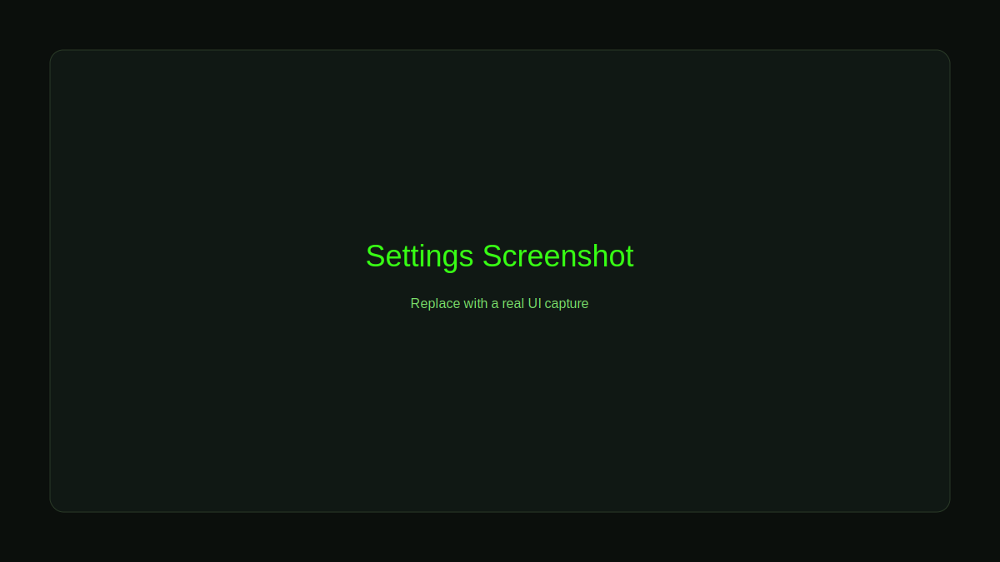

# Bug Exorcist
Autonomous AI debugging that reproduces, fixes, and verifies runtime errors in a secure sandbox.

## What This Project Does
Bug Exorcist captures an error, reproduces it in a sandboxed container, asks an AI model to generate a fix, and verifies that the fix actually resolves the problem.

## How It Works (End-to-End)
1. Client sends error message, code snippet, and optional context.
2. Agent analyzes the failure and proposes a fix.
3. Fix is executed inside a Docker sandbox.
4. Verification output determines pass or fail.
5. Result, explanation, and usage data are returned.

## Key Features
* Sandbox execution with resource limits
* AI-driven fix generation with retry logic
* Verification loop with automatic fallback guidance
* Optional RAG for codebase-aware fixes
* REST API + WebSocket streaming for live progress

## Architecture
* **Frontend**: Next.js dashboard for sessions and thought stream
* **Backend**: FastAPI REST + WebSocket endpoints
* **Core**: Agent logic, providers, retry flow, parsing, verification
* **Sandbox**: Dockerized execution with security restrictions

## Requirements
* Node.js 18+
* Python 3.10+
* Docker Desktop

## Project Structure
```
backend/   FastAPI server, database, sandbox
core/      AI agent logic
frontend/  Next.js app
tests/     Python tests
```

## Quick Start (Local)

### 1. Clone
```bash
git clone https://github.com/your-username/bug-exorcist.git
cd bug-exorcist
```

### 2. Configure Environment
```bash
cp .env.example .env
```

### 3. Backend
```bash
cd backend
python -m pip install -r requirements.txt
python -m uvicorn app.main:app --reload
```

### 4. Frontend
```bash
cd frontend
npm ci
npm run dev
```

### 5. Full Stack (Docker)
```bash
docker-compose up --build
```

## Configuration
Set these in `.env` or your shell.

| Variable | Description | Required |
| --- | --- | --- |
| `OPENAI_API_KEY` | OpenAI API key for GPT-4o | Yes |
| `GEMINI_API_KEY` | Gemini API key for fallback | No |
| `ENABLE_RAG` | Enable RAG context retrieval | No |
| `ALLOWED_REPO_ROOT` | Allowed repo root for RAG in prod | Prod only |
| `RAG_EMBEDDING_PROVIDER` | `openai` or `huggingface` | No |
| `RAG_RETENTION_DAYS` | Auto-clear vector DB | No |
| `ENABLE_FALLBACK` | Manual fallback guidance | No |
| `ENABLE_GEMINI_FALLBACK` | Gemini fallback toggle | No |
| `ALLOW_MOCK_LLM` | Use mock LLM for tests/CI | No |

## API Reference

### Analyze and Fix
`POST /api/agent/analyze`

Example:
```bash
curl -X POST http://localhost:8000/api/agent/analyze \
  -H "Content-Type: application/json" \
  -d '{
    "error_message": "ZeroDivisionError: division by zero",
    "code_snippet": "def divide(a,b): return a/b",
    "language": "python",
    "use_retry": true,
    "max_attempts": 3
  }'
```

### Retry Workflow Only
`POST /api/agent/fix-with-retry`

### Quick Fix
`POST /api/agent/quick-fix`

### Verify Fix
`POST /api/agent/verify`

### Health Checks
* `GET /api/agent/health`
* `GET /health`

## WebSocket Endpoints
* `/ws/logs/{bug_id}` for streaming logs
* `/ws/thought-stream/{session_id}` for real-time thought stream

## Sandbox Behavior
* Runs code in isolated containers
* Limits CPU and memory
* Blocks external network access by default
* Supports Python, JS, Go, Rust, Bash, and test runners

## RAG Notes
* Uses ChromaDB for vector search
* Skips sensitive files (`*.env`, `*secret*`, `*.pem`, `*.db`)
* Auto-clears old embeddings using `RAG_RETENTION_DAYS`

## Testing
```bash
python -m pytest
```

Frontend checks:
```bash
cd frontend
npm run lint
npm run build
```

## CI
CI runs backend tests and frontend lint/build. It uses mock LLMs in CI to avoid API key requirements.

## Troubleshooting
* Missing Docker: install Docker Desktop and verify `docker --version`
* Port conflicts: change ports or stop the conflicting service
* No API key: set `OPENAI_API_KEY` or enable `ALLOW_MOCK_LLM=true`

## Screenshots
Place images in `frontend/public/` and reference them here:






## Demo GIFs
Place GIFs in `frontend/public/` and reference them here:


## Deployment Guide

### Option 1: Docker Compose (Recommended)
```bash
docker-compose up --build
```

### Option 2: Manual Deployment
Backend:
```bash
cd backend
python -m pip install -r requirements.txt
python -m uvicorn app.main:app --host 0.0.0.0 --port 8000
```

Frontend:
```bash
cd frontend
npm ci
npm run build
npm run start -- --port 3000
```

### Production Notes
* Set `ENVIRONMENT=production`
* Set `ALLOWED_REPO_ROOT` if RAG is enabled
* Configure secrets using your platform’s secret manager
* Put the backend behind HTTPS and a reverse proxy

## FAQ

**Q: Can I run this without an API key?**  
A: Yes. Set `ALLOW_MOCK_LLM=true` for local testing and CI.

**Q: Is the sandbox secure?**  
A: The sandbox runs in Docker with resource limits and restricted networking. Do not run untrusted code without reviewing your settings.

**Q: Why does RAG skip some files?**  
A: Sensitive patterns (`*.env`, `*secret*`, `*.db`) are intentionally excluded to reduce risk.

**Q: How do I add support for a new language?**  
A: Update the language allowlist and sandbox command map, then add tests.

## Contributing
Read `CONTRIBUTING.md` for setup and workflow.

Quick rules:
* Open an issue before non-trivial work
* Keep PRs focused and link the issue
* Include tests or clear verification steps

## Security
See `SECURITY.md` for reporting vulnerabilities.
